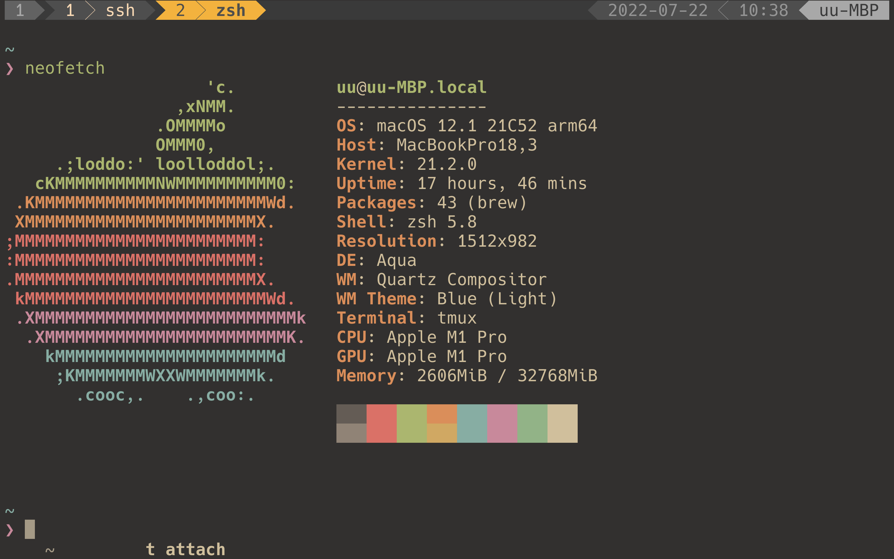

# dotfiles

A collection of the dotfiles I need to remain sane when using \*NIX.



## Dependency

- `GNU stow`
- `git`
- `zsh`

## How to install

1. Deploy the files:

```sh
git clone https://github.com/ucchiee/dotfiles ~/dotfiles
stow -d ~/dotfiles --ignore=etc */
```

2. Restart your `zsh`

3. (Optional) Enable Python and Nodejs using asdf:

```
asdf plugin add python
asdf plugin add nodejs
asdf install
asdf reshim
```

(Now you can use neovim as well !)

## Useful Tools

- alacritty
- asdf
- bat
- bottom
- fd
- fzf
- git-delta
- lazygit
- lazydocker
- ncdu
- neovim
- ranger
- ripgrep
- ripgrep-all
- silversearcher-ag
- tmux
  - reattach-to-user-namespace(for mac)
- universal-ctags

## Fonts

See the link below for more information. I recommend you to use `Hack Nerd Font`.

https://github.com/ryanoasis/nerd-fonts

### Hack Nerd Font ( Ubuntu )

1. Download latest version of Hack.
   1. See this page : https://github.com/ryanoasis/nerd-fonts/tree/master/patched-fonts/Hack#quick-installation
2. Extract the files from the zip file.
3. Copy them to `~/.local/share/fonts`

### Hack Nerd Font ( MacOS )

```
brew tap homebrew/cask-fonts
brew install --cask font-hack-nerd-font
```

If you have installed nerd-fonts, reinstall them like this:

```
brew reinstall font-hack-nerd-font
```

## OS specific setting

### MacOS

Speeds up key repeat:

```
defaults write -g KeyRepeat -int 1.3
```

## TODO

1. Write this README.
   1. Write about zsh and its plugin manager.
1. Make tmux config better and easy to read.
